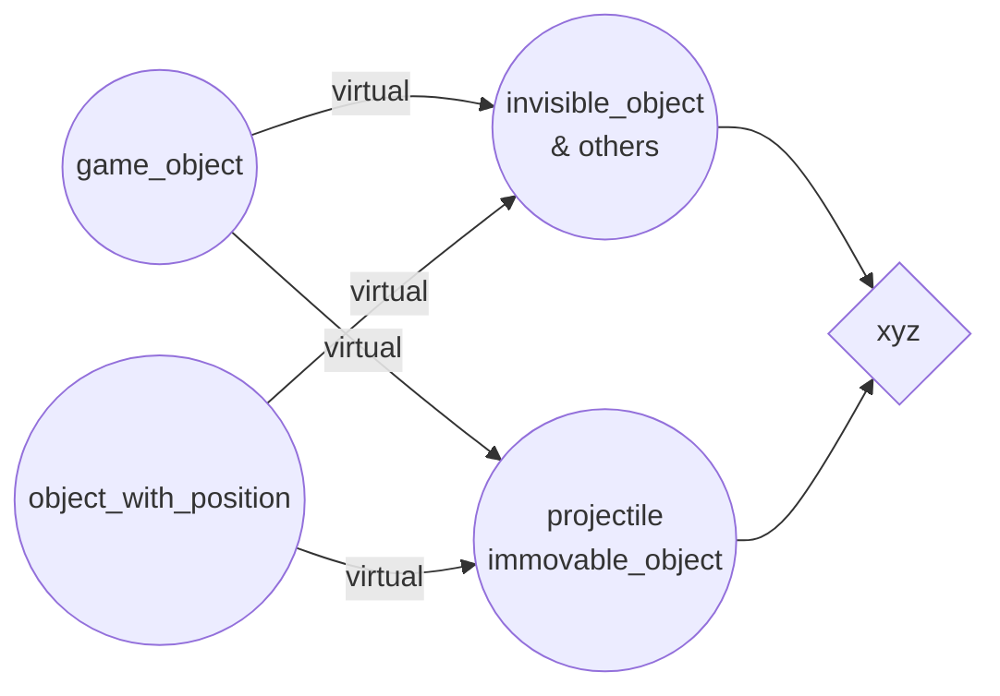

#  Множественное  наследование
``` c++
struct base1
{
	int a;
	int b;
	virtual void f();
};

struct base2{
	int a;
	int c;
	int d;
}

struct derived : base1, base2{
	int e;
	int f
};

int main()
{
	derived d;
	d.base1::a;
}
```
$\Uparrow$ $\Uparrow$ $\Uparrow$ $\Uparrow$ $\Uparrow$ $\Uparrow$
Мы должны указывать какая функция нам нужна.
```c++
struct x{
	int a;
	virtual void f()=0;
};

struct y: virtual x {
    void f() {}
    //void f(int*) override final
	int b;
};

struct z : virtual x{
    void f(){}
     //void f(int*) override
	int c;
};

struct w : y, z{
	int d;
};
```
Без  ***virtual*** случае будет в **w** будет 2 *(int)* **a**.
Если мы помечаем базы как ***virtual***, ты мы ''шэирим с остальными чуваками'' и копий не возникает.
Если  не помечаем то получаем subobject
***override*** -- ключевое слово для переопределения функции в дочернем классе.
***final*** -- функция больше не может быть соверрайдена
```c++
struct game_object{
	virtual void update( double time = 0);
	virtual void render( ) = 0;
};
```


